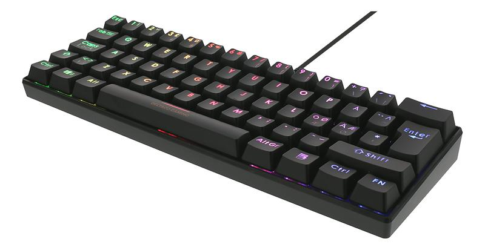

# Deltaco Gaming GAM-075 — QMK + VIA

This is a fork of [SonixQMK/qmk_firmware](https://github.com/SonixQMK/qmk_firmware) (`sn32_develop` branch), adding full **ISO layout support** and a working **VIA** setup for the Deltaco Gaming GAM-075 — also sold under various Royal Kludge RK61 RGB clone listings, since this board's PCB is shared across several rebrands.

If you have this exact keyboard and just want remapping/RGB control working, skip to [Quick Start](#quick-start). If you want to build the firmware yourself, see [Building from Source](#building-from-source).



## Is this your keyboard?

Confirm your MCU before going further — check the chip printed on the PCB, or the info on the sticker/box:

- **MCU:** `HFD2201KBA` (a rebrand of `SN32F248BF`)
- Sold as: Deltaco Gaming GAM-075, and various Royal Kludge RK61 RGB clones
- Layout: 61-key ISO (this fork), also works as ANSI via the upstream `default` keymap

If your board reports a different MCU, this port likely won't apply — the matrix/RGB driver wiring is specific to this exact chip and PCB.

## What's different from upstream `sn32_develop`

Upstream's `royal_kludge/rk61_rgb` only defines the ANSI layout. This fork adds:

- `keymaps/iso/` — a full ISO keymap (Win/Mac dual-layer switching, function layer, modern `RM_`-prefixed RGB keycodes), adapted from the existing `default` ANSI keymap
- `LAYOUT_60_iso` added to `keyboard.json`, alongside the existing ANSI layout
- Two missing RGB LED positions added to `keyboard.json` (`[3,1]` and `[2,12]`) — present and lit on the ISO board, but absent from the ANSI-only upstream LED map
- A custom **trans pride flag** RGB effect (`rgb_matrix_user.inc`) — the 5 keyboard rows lit as the 5 flag stripes
- A working [VIA](https://www.caniusevia.com/) definition (V3 format), since this board isn't in VIA's official list

## Quick Start

**You don't need to compile anything to use VIA** — grab the pre-built firmware from [Releases](../../releases).

### 1. Flash the firmware

Enter bootloader mode by following the instructions in the [SonixQMK docs](https://sonixqmk.github.io/SonixDocs/install/).

Use [SonixFlasherC](https://github.com/SonixQMK/SonixFlasherC) — **not** the older `sonix-flasher` GUI tool, which its own README now marks deprecated/unsafe.

Make sure to use your USB Vendor ID and Product ID. Under linux, you can find them with `lsusb`.

```bash
sudo ./sonixflasher --vidpid 0c45/7040 --file rk61_rgb_iso.bin --offset 0x0000
```

Do **not** pass `-j` — that flag is for flashing a separate "jumploader" component this board doesn't use. This board's native ISP bootloader is flashed directly at offset `0`.

### 2. Set up VIA

1. Get VIA from [the-via/releases](https://github.com/the-via/releases/releases), or use [usevia.app](https://usevia.app) in a Chromium-based browser.
2. In Settings, enable **"Show Design tab"**.
3. Go to the **Design tab**, load [`via/deltaco_gam075_via_v3.json`](via/deltaco_gam075_via.json) from this repo.
4. Go to **Configure**, click **"Authorize device"** (do this fresh, even if already connected — re-authorizing after loading the definition is required for VIA to pick it up).

You should now have full keymap remapping and live RGB Matrix control.

## Building from Source

```bash
git clone --branch sn32_develop --single-branch https://github.com/<your-fork>/qmk_firmware.git
cd qmk_firmware
git submodule update --init --recursive
make royal_kludge/rk61_rgb:iso
```

### If the build fails with missing files (LUFA, printf, etc.)

Some submodules can end up registered but never actually checked out (shows as an empty directory, or one containing only a `.git` pointer file). If you hit `fatal error: ... No such file or directory` referencing something under `lib/`, check:

```bash
for d in lib/chibios lib/chibios-contrib lib/googletest lib/lufa lib/lvgl lib/pico-sdk lib/printf lib/vusb; do
  echo "=== $d ==="; ls "$d" | wc -l
done
```

Any directory reporting a suspiciously low count is broken. Force a full reset rather than fixing them one at a time as each missing file surfaces in a new error:

```bash
git submodule deinit -f --all
rm -rf .git/modules
git submodule update --init --recursive --force
```

## Known Gotchas (if you're extending this yourself)

- **`keyboard.json`'s layout schema does not support KLE's multi-rectangle key trick** (`w2`/`h2`/`x2`, used for the ISO Enter key's true L-shape). Using it silently discards the *entire file*, not just that one entry, producing confusing downstream errors ("No LAYOUTs defined", bootmagic range errors, missing bootloader). The VIA JSON format *does* support this trick — just not `keyboard.json` itself. Use a plain rectangle there instead.
- **VIA's built-in `"qmk_rgb_matrix"` menu preset queries channel 2 (`RGBLIGHT`)**, which this board doesn't implement (it uses `RGB_MATRIX_ENABLE`, channel 3). This causes the whole Lighting tab to fail to load. The included `via/deltaco_gam075_via_v3.json` works around this with a fully custom `menus` block bound explicitly to channel 3.
- **RGB Matrix effect numbering** is determined by `#include` order in `quantum/rgb_matrix/animations/rgb_matrix_effects.inc`, filtered to only the effects your `keyboard.json` enables — **not** the order they're listed in `keyboard.json` itself. If you add/remove effects, the VIA JSON's `Effect` dropdown numbering needs to be recalculated to match.
- Custom effects (like the trans flag one here) get appended after the last built-in enabled effect in the enum — verify the actual number empirically (cycle to it with `RM_NEXT` and confirm) rather than assuming.

## Credits

Built on the work of many people across this board's history:
- Dimitris Mantzouranis, Philip Mourdjis, Fernando Birra — original `royal_kludge/rk61_rgb` ANSI port on `sn32_develop`
- euwbah, ab00a — earlier SN32 fork lineage this board's matrix/RGB driver work traces back to
- [SonixQMK](https://github.com/SonixQMK) — for maintaining SN32 support in QMK at all

## License

GPLv2, same as upstream QMK. See [LICENSE](LICENSE).
